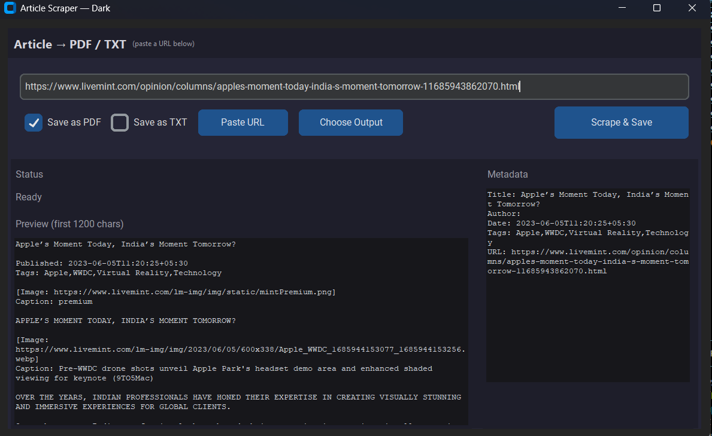

# Article Scraper (Dark GUI)

A modern desktop application for extracting clean articles from websites and saving them as **PDF** (with images) or **TXT**.  
The interface is built with **CustomTkinter** in a VS Code–inspired dark theme.

---

##  GUI 

  

---

## Description

This tool allows you to paste any article URL and download a distraction-free version of the content.  
It captures the article’s **title, author, date, text, and images** while removing ads and sidebars.  
Output can be saved as a clean **PDF** (with embedded images) or a simple **text file**.  

The app works on **Windows, macOS, and Linux**, and can optionally use **Playwright** to handle JavaScript-heavy websites.

